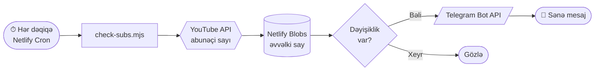

<div align="center">


### YouTube abunəçi sayını **7/24** izləyir. Hədəfə çatanda Telegrama **anında** yazır.

<br/>


<br/>

**`Sıfır server`** &nbsp;·&nbsp; **`Sıfır əlavə xərc`** &nbsp;·&nbsp; **`Kompüter söndürülsə də işləyir`**

</div>

<br/>

---

## ✦ Nə edir?

Brauzer tabı açıq qalmalı deyil. Bot buludda işləyir, hər dəqiqə kanalı yoxlayır və dəyişiklik olanda sənə Telegramdan xəbər verir.

<table>
<tr>
<td width="50%" valign="top">

### 🎯 Hədəf bildirişləri
Kanal yeni mərhələyə çatanda mesaj gəlir.

`1K` · `5K` · `10K` · `25K` · `50K` · `100K` · `250K` · `500K` · `1M`

</td>
<td width="50%" valign="top">

### 📈 Hər dəyişiklikdə
İstəsən hər artım və azalma haqqında da yazsın. Rejimi bir dəyişənlə seçirsən.

`milestone` &nbsp;|&nbsp; `everyChange`

</td>
</tr>
<tr>
<td width="50%" valign="top">

### 🧠 Yaddaşlı
Əvvəlki sayı **Netlify Blobs**-da saxlayır. Yenidən deploy etsən də təkrar bildiriş göndərmir.

</td>
<td width="50%" valign="top">

### 🛡️ Özünü izləyir
YouTube sorğusu ardıcıl 5 dəfə uğursuz olsa, Telegrama xəbərdarlıq gəlir. Düzələndə də bildirir.

</td>
</tr>
</table>

<br/>

## ✦ Necə işləyir?



<br/>

## ✦ Mesaj nümunələri

```text
🎉 KABUS X kanalı 10.000 abunəçiyə çatdı!

📈 KABUS X: +3 abunəçi (indi 10.003)

⚠️ YouTube sorğusu 5 dəfə uğursuz oldu: quotaExceeded

✅ KABUS X: izləmə bərpa olundu (10.003)
```

<br/>

## ✦ Sürətli quraşdırma

> **4 addım. Təxminən 5 dəqiqə.**

**① &nbsp;Repo-nu Netlify-a bağla**
`app.netlify.com` → **Add new project** → **Import an existing project** → bu repo-nu seç.

**② &nbsp;Mühit dəyişənlərini əlavə et**
`Site configuration` → `Environment variables`

| Dəyişən | Məcburi | Təsvir |
|---|:---:|---|
| `YT_API_KEY` | ✅ | YouTube Data API v3 açarı |
| `CHANNEL_ID` | ✅ | Kanalın ID-si (`UC...` ilə başlayır) |
| `TG_TOKEN` | ✅ | @BotFather-dən aldığın bot tokeni |
| `TG_CHAT_ID` | ✅ | Mesajın göndəriləcəyi çat ID-si |
| `NOTIFY_MODE` | ➖ | `milestone` (defolt) və ya `everyChange` |

**③ &nbsp;Deploy et**
**Deploy** düyməsinə bas. Netlify funksiyanı avtomatik hər dəqiqə işə salacaq.

**④ &nbsp;Telegramı yoxla**
Bir-iki dəqiqə içində `✅ izləmə başladı` mesajı gəlməlidir.

<br/>

## ✦ Layihə quruluşu

```text
kabusx-netlify/
├── 📄 netlify.toml            Netlify ayarları
├── 📄 package.json            Asılılıqlar
├── 📁 public/
│   └── index.html             Boş səhifə (Netlify üçün lazımdır)
└── 📁 netlify/
    └── 📁 functions/
        └── check-subs.mjs     ⭐ Botun özü
```

<br/>

## ✦ Bilməli olduqların

| | |
|---|---|
| ⏱ **İnterval** | Netlify cron-un ən sıx variantı **1 dəqiqədir**. |
| 🔢 **Yuvarlaqlaşdırma** | YouTube 1000-dən çox abunəçisi olan kanallarda sayı yuvarlaqlaşdırıb verir. `everyChange` rejimi yalnız bu rəqəm dəyişəndə işləyir. |
| 📊 **Kvota** | Gündə 1.440 sorğu, YouTube-un 10.000 pulsuz limitinin çox altındadır. |
| 🚀 **Deploy** | Scheduled function yalnız **publish olunmuş** deploy-da işləyir. |
| 💳 **Netlify limiti** | Ayda ~43.200 çağırış edir. Planının limitlərinə bax. |

<br/>

## ✦ Təhlükəsizlik

> [!WARNING]
> **Açarları və tokenləri heç vaxt koda yazma.** Onların hamısı yalnız Netlify-ın *Environment variables* bölməsində olmalıdır.
> Token və ya API açarı bir yerdə açıq görünübsə: Telegram üçün `@BotFather` → `/revoke`, YouTube üçün Google Cloud Console-da açarı yenilə.

<br/>

<details>
<summary><b>🔧 Mesaj gəlmir? Problemləri həll et</b></summary>

<br/>

Netlify-da **Logs → Functions → check-subs** bölməsinə bax.

| Logdakı xəta | Səbəb və həll |
|---|---|
| `chat not found` | Botuna Telegramda `/start` yazmamısan və ya `TG_CHAT_ID` səhvdir. |
| `Unauthorized` | `TG_TOKEN` səhvdir. |
| `API key not valid` | `YT_API_KEY` səhvdir və ya YouTube Data API v3 aktiv deyil. |
| `quotaExceeded` | Gündəlik YouTube kvotası bitib. Gecə yarısı (Pasifik vaxtı) sıfırlanır. |
| Heç nə görünmür | Deploy publish olunmayıb və ya mühit dəyişənlərini əlavə etdikdən sonra yenidən deploy etməmisən (**Deploys → Trigger deploy**). |

</details>

<br/>

<div align="center">


**KABUS X** &nbsp;·&nbsp; hər abunəçi sayılır

</div>
